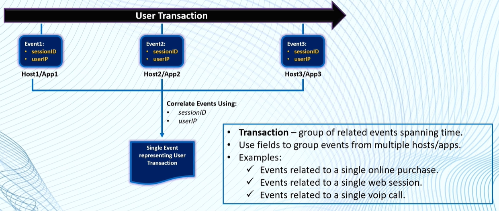

# Splunk

## 4. Correlating Events

<figure><figcaption></figcaption></figure>

### Transaction Command

```
transaction field1 field2 field3..
or
transaction field1, field2, field3..
```


### Filtering Transactions

```
index="web" sourcetype="access_combined"
| transaction JSESSIONID
| search action="purchase"
| highlight JSESSIONID, purchase
```

```
index="main" sourcetype="eventgen"
| transaction userIPAddress deviceMAC
| where userIPAddress LIKE "192.168.135.%"
| highlight userIPAddress, deviceMAC
```

### Transactions Contraints

<figure><figcaption></figcaption></figure>

```
index="web" sourcetype="access_combined"
| transaction JSESSIONID, clientip maxspan=5s maxpause=1s maxevents=10
| table JSESSIONID, clientip, duration, eventcount, action
| sort -duration
| search action="purchase"
| eval duration=tostring(duration, "duration")
```

<figure><figcaption></figcaption></figure>

```
index="web" sourcetype="access_combined"
| transaction JSESSIONID, clientip startswith=eval(action="addtocart") endswith="purchase"
| table JSESSIONID, clientip, duration, eventcount, action
| sort -duration
| search action="purchase"
| eval duration=tostring(duration, "duration")
```

<figure><figcaption></figcaption></figure>

```
index="web" sourcetype="access_combined"
| transaction JSESSIONID, clientip maxspan=5 maxpause=1 maxevents=10 keepevicted=t
| eval closed_txn=if(closed_txn==0,"Evitced","Not Evitced")
| chart count as "Number of Transcation" over closed_txn
```


### Report on Transactions

### Transactions vs Stats&#x20;
